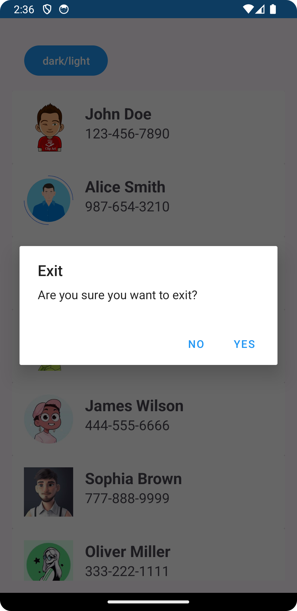
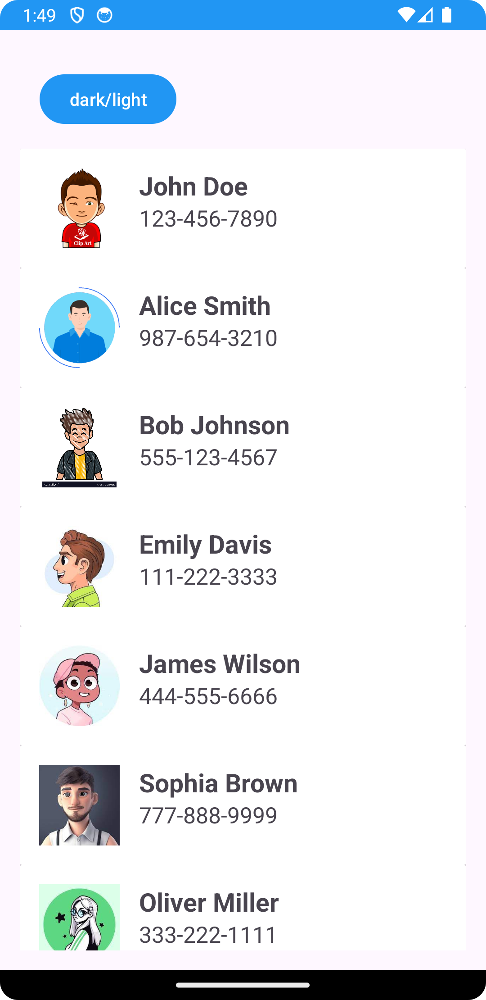
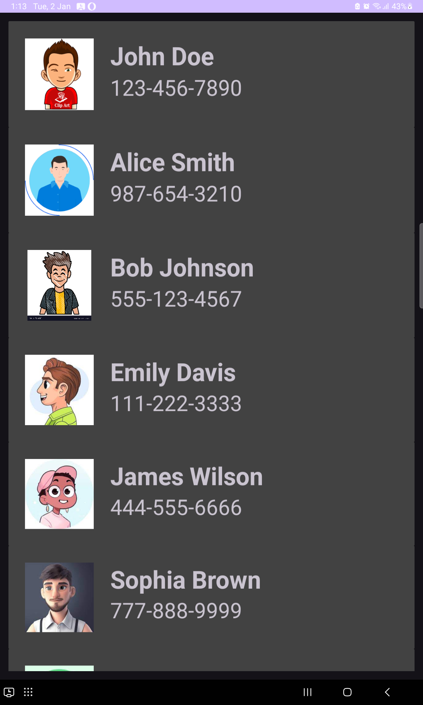
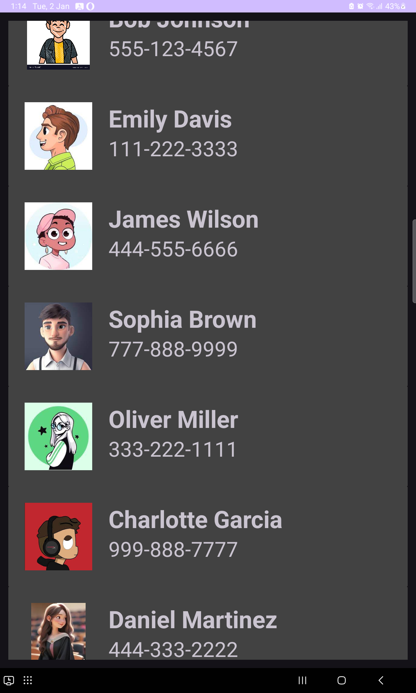

# RecyclerView Contact List

A simple Android app demonstrating a contact list using RecyclerView and utilizing ssp and sdp for text sizes and dimensions.

## Overview

This app displays a list of contacts using a RecyclerView, showing contact names and phone numbers with images. It leverages ssp for text sizes and sdp for dimensions, ensuring scalability across different screen sizes.

## Features

- Displays a list of contacts
- Each contact item includes:
    - Name
    - Phone number
    - Contact image

## Prerequisites

- Android Studio
- Android SDK
- Basic knowledge of Android development

## Getting Started

1. **Clone the Repository:**

    ```bash
    git clone https://github.com/your_username/RecyclerView-ContactList.git
    ```

2. **Open in Android Studio:**

    - Open Android Studio
    - Click on "Open an existing Android Studio project"
    - Navigate to the cloned project directory and select it

3. **Run the App:**

    - Connect an Android device or use an emulator
    - Click on the "Run" button in Android Studio

## Usage of ssp and sdp

The app uses ssp (Scalable Pixel) and sdp (Scalable Density Pixel) for text sizes and dimensions respectively. These units allow for responsive design across various screen sizes by automatically scaling according to the device's screen density.

For text sizes, use `@dimen/_16ssp` for 16 scaled sp and `@dimen/_14ssp` for 14 scaled sp.

For dimensions, use `@dimen/_50sdp` for 50 scaled dp, `@dimen/_8sdp` for 8 scaled dp, and `@dimen/_12sdp` for 12 scaled dp.

## Screenshots






